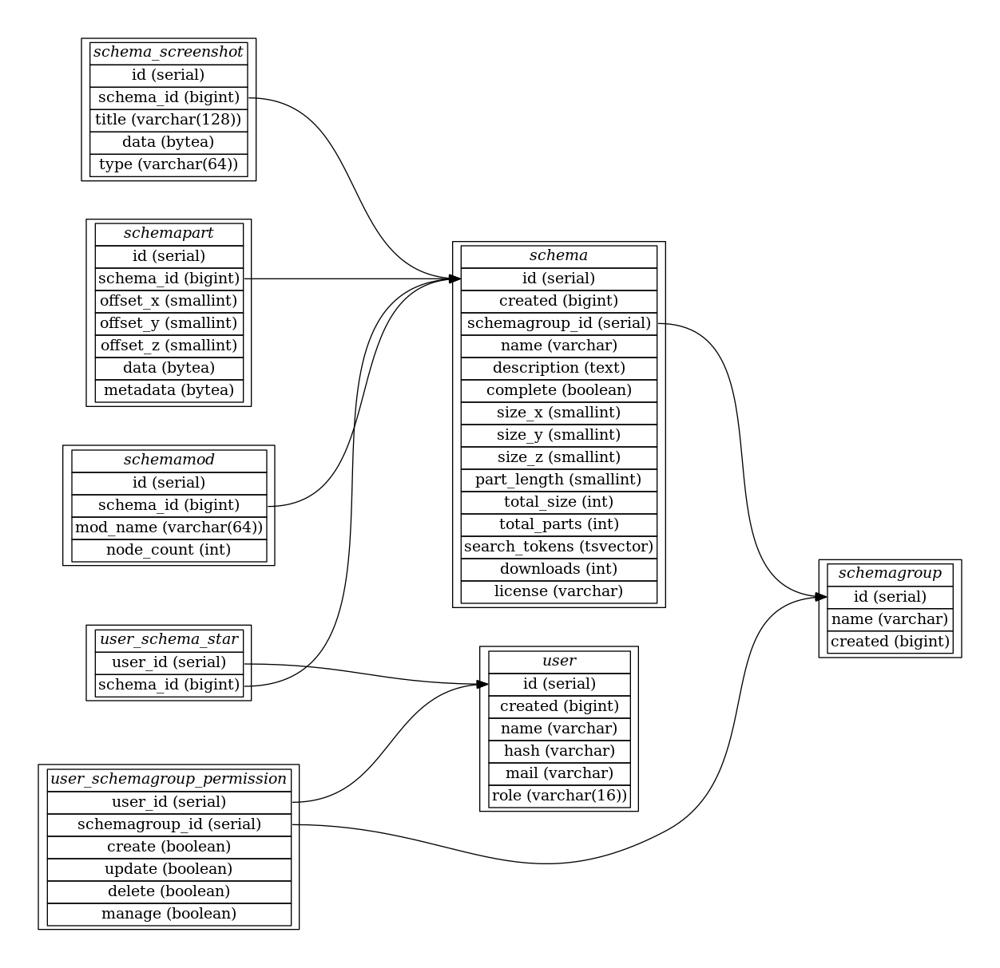

minetest blockexchange server software


# Overview

Corresponding mod and more information: https://github.com/blockexchange/blockexchange

# Running

## Requirements

* Running postgres database

## Environment variables

* **PGUSER**
* **PGPASSWORD**
* **PGHOST**
* **PGPORT**
* **PGDATABASE**
* **BLOCKEXCHANGE_KEY** private key to sign the json web tokens with
* **DISCORD_SCHEMA_FEED_URL** discord webhook for the "new schema" feed
* **GITHUB_APP_SECRET** Github app secret key
* **GITHUB_APP_ID** Github app ID

## Docker usage

Image: https://hub.docker.com/r/blockexchange/blockexchange

This example shows a simple throw-away setup.

Start a postgres server:
```bash
docker run --rm -it \
 -e POSTGRES_PASSWORD=enter \
 --network host \
 postgres
```

Start the server part:
```bash
docker run -it --rm \
 -e PGUSER=postgres \
 -e PGPASSWORD=enter \
 -e PGHOST=127.0.0.1 \
 -e PGDATABASE=postgres \
 -e PGPORT=5432 \
 -e BLOCKEXCHANGE_KEY=blah \
 --network host \
 blockexchange/blockexchange
```

Go to http://127.0.0.1:8080

## docker-compose usage

A `docker-compose` example:

```yml
version: "2"

services:
 blockexchange:
  image: blockexchange/blockexchange
  restart: always
  depends_on:
   - postgres
  environment:
   - PGUSER=postgres
   - PGPASSWORD=enter
   - PGHOST=postgres
   - PGDATABASE=postgres
   - PGPORT=5432
   - BLOCKEXCHANGE_NAME=My-Blockexchange
   - BLOCKEXCHANGE_OWNER=yourname
  ports:
   - "8080:8080"

 postgres:
  image: postgres:12
  restart: always
  environment:
   POSTGRES_PASSWORD: enter
  volumes:
   - "./data/postgres:/var/lib/postgresql/data"
```


# Development

Web- and backend development

Prerequisites:
* docker
* docker-compose

```
# start the postgres database
docker-compose up -d postgres

# start the blockexchange server
docker-compose up -d blockexchange

# start the minetest server
docker-compose up -d minetest
```

The blockexchange UI is at http://127.0.0.1:8080 and the minetest server is reachable via 127.0.0.1:30000

# Database

Database model:



# License

Code: MIT

Textures:
* public/textures/default*.png CC BY-SA 3.0 https://github.com/minetest/minetest_game/
